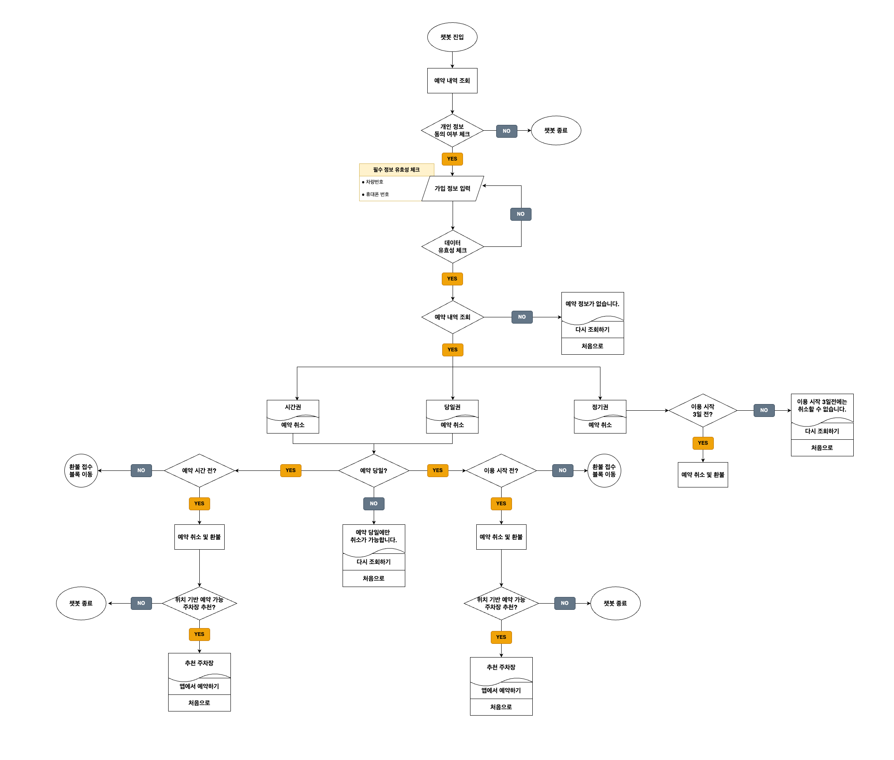

# 파프봇 - 카카오 챗봇 기반 고객 응대 자동화 시스템

> **파프봇**은 주차 서비스의 예약 확인/취소 및 환불 접수를 **카카오 챗봇 기반으로 자동화**한 프로젝트입니다.  
> 사용자 편의성과 CS 효율화를 위해 챗봇을 통해 예약조회부터 증빙자료 업로드까지 모두 처리할 수 있도록 구성했습니다.

#### 💡 이 프로젝트는 실제 서비스에 적용된 코드 중 `일부만 발췌하여 구성된 예시용 코드`입니다.

---

### 플로우차트



---

### 기술 스택

| 항목          | 사용 기술                                         |
| ------------- | ------------------------------------------------- |
| Backend       | Node.js, Express                                  |
| DB            | MySQL                                             |
| 예약 스케줄러 | node-schedule                                     |
| 챗봇 템플릿   | Kakao i 오픈빌더 (TextCard, ItemCard, Carousel)   |
| 운영환경      | NHN Cloud Linux 인스턴스 (PM2 기반 프로세스 운영) |

---

### 주요기능

- 카카오 i 오픈빌더 연동하여 **예약 조회, 예약 취소, 환불 요청 등 챗봇 블록 기반 흐름 제어**
- 사용자 입력값 또는 환불 정책 등에 따른 **동적 응답 및 자동 분기 처리**
- **사진(환불 증빙자료) 리사이징** 후 서버 저장 및 1개월 후 **자동 삭제 스케줄러** 구현

```
📁 kakao-chatbot-system/
├── common/
│   ├── buttons.js       # 블록 버튼 템플릿
│   └── templates.js     # 카카오 응답 템플릿 (TextCard, Carousel 등)
├── public/
│   └── images/          # 업로드 이미지 저장 경로
├── routes/
│   ├── agreement/       # 개인정보 수집 동의
│   ├── inquiry/         # 예약 조회
│   ├── cancel/          # 예약 취소 안내
│   ├── photo/           # 사진 업로드 및 환불 접수
├── scheduler/
│   ├── imageCleanup.js  # 이미지 자동 삭제 로직
│   └── index.js         # node-schedule 등록
├── app.js               # 서버 실행 및 스케줄러 등록
└── package.json
```

#### 1. 개인정보 수집 동의 (agreement)

- 텍스트 카드로 이용약관 안내 및 블록 이동 선택

#### 2. 예약 조회 (inquiry)

- `차량번호 + 휴대폰번호` 기반 예약 목록 조회
- 예약 항목에 따라 "예약 취소" 블록으로 이동 가능

```json
// Request Body (챗봇 구조 기반)
{
  "action": {
    "detailParams": {
      "car_no": { "origin": "123가4567" },
      "phone_no": { "origin": "01012345678" }
    }
  }
}
```

```json
// 응답 (예약 정보 있음)
{
  "version": "2.0",
  "template": {
    "outputs": [
      {
        "carousel": {  // 캐러셀 형식으로 출력
          "type": "itemCard",
          "items": [
            {
              "imageTitle": { "title": "xxx주차장", "description": "시간권" },
              "itemList": [...],
              "buttons": [
                {
                  "action": "block",
                  "label": "예약 취소",
                  "blockId": "xxxx",
                  "extra": { ... }
                }
              ]
            }
          ]
        }
      }
    ]
  }
}
```

```json
// 응답 (예약 정보 없음)
{
  "template": {
    "outputs": [
      {
        "textCard": {
          "title": "예약 정보가 없습니다.",
          "buttons": [
            { "label": "다시 조회하기", "blockId": "xxxx" },
            { "label": "처음으로", "blockId": "xxxx" }
          ]
        }
      }
    ]
  }
}
```

#### 3. 예약 취소 분기 (cancel)

- 예약 날짜 및 시간 기반 취소 가능 여부 판단
- 취소 불가능한 경우 "환불 접수" 블록 연결
- **_취소 가능 시 환불 예정 금액/포인트 계산_**

---

```
취소 가능 조건: 1)오늘이 예약일이고 2) 현재 시각이 '예약시간 이전'
```

```json
// 1. 취소 가능 응답
{
  "textCard": {
    "title": "위 예약을 취소해드릴까요?",
    "description": "• 환불예정금액 : 4,000 원 • 환불예정포인트 : 800 포인트",
    "buttons": [
      {
        "label": "네, 취소합니다.",
        "blockId": "xxxx",
        "extra": {
          "...": "예약 정보 + reason 포함"
        }
      },
      { "label": "아니오, 챗봇을 종료합니다.", "blockId": "xxx" }
    ]
  }
}
```

```json
// 2. 당일이지만 취소 불가
{
  "textCard": {
    "title": "이용 시작 시간이 초과하여 취소가 불가능합니다.",
    "description": "부정주차 또는 공사중으로 인해 주차가 어려운 상황이시면 환불 접수를 도와드릴게요!",
    "buttons": [
      { "label": "환불 접수", "blockId": "xxx" },
      { "label": "다시 조회하기", "blockId": "xxx" }
    ]
  }
}
```

```json
// 3. 취소불가 - 예약 당일 아님
{
  "textCard": {
    "title": "예약 당일에만 취소가 가능합니다.",
    "buttons": [
      { "label": "다시 조회하기", "blockId": "xxx" },
      { "label": "처음으로", "blockId": "xxx" }
    ]
  }
}
```

#### 4. 사진 업로드 및 환불 접수 (photo)

- 사용자가 업로드한 이미지 URL 다운로드
- `sharp` 라이브러리 기반 이미지 리사이징/압축 후 서버 저장
- DB에 환불 요청 정보 및 이미지 URI 저장

| 단계                    | 설명                                                         |
| ----------------------- | ------------------------------------------------------------ |
| 1) 이미지 URL 수신      | 카카오 챗봇에서 받은 base64 이미지 or 카카오 URL             |
| 2) 이미지 다운로드      | `axios`로 스트리밍 다운로드                                  |
| 3) 이미지 리사이징/압축 | `sharp` 라이브러리 사용 → `width 680px`, `jpeg(30% quality)` |
| 4) 파일 저장            | `/public/images/YYYYMMDD_second_uuid.jpeg` 형식              |
| 5) DB 저장              | `refund` 테이블에 order_id, reason, image URI 등 기록        |

```js
const transformer = sharp()
  .resize({ width: 680 }) // 너비 680px로 리사이징
  .jpeg({ quality: 30 }); // JPEG 품질 30%로 압축

response.data
  .pipe(transformer) // 이미지 스트림에 리사이징 적용
  .pipe(fs.createWriteStream(savePath)); // 서버에 저장
```

#### 5. 이미지 자동 삭제 스케줄러 (scheduler)

- 저장된 이미지 파일의 파일명에서 날짜를 추출
- 서버 리소스 누적 방지를 위해 생성일 기준 1개월이 지난 이미지 자동 삭제
- `node-schedule`을 활용하여 매일 새벽 3시에 실행

**\*주요 처리 방식**
| 항목 | 내용 |
|------|------|
| 삭제 대상 | `public/images/` 내 `YYYYMMDD_second_uuid.jpeg` 형식의 파일 |
| 기준 날짜 | 파일명에서 추출한 날짜 (`YYYYMMDD`) |
| 보관 기간 | **30일(1개월)** 유지 후 삭제 |
| 실행 주기 | 매일 새벽 3시 |
| 라이브러리 | `node-schedule` 사용

**\*삭제 로직 요약(imageCleanup.js)**

```js
// 파일명에서 날짜 추출: YYYYMMDD_*
const match = file.match(/^(\d{8})_\d+_/);

const fileDate = new Date(
  Number(dateStr.slice(0, 4)), // 연도
  Number(dateStr.slice(4, 6)) - 1, // 월
  Number(dateStr.slice(6, 8)) // 일
);

const age = now - fileDate.getTime();
if (age > ONE_MONTH_IN_MS) {
  fs.unlink(filePath); // 30일 이상 경과 시 삭제
}
```

**\*스케줄러 등록**

```js
const schedule = require('node-schedule');
const { imageCleanup } = require('./imageCleanup');

schedule.scheduleJob('0 3 * * *', () => {
  imageCleanup(); // 매일 새벽 3시에 실행
});
```
